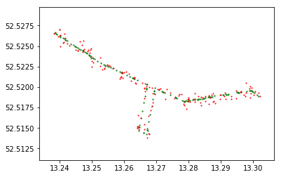

# Geotools

Core library for mapping & routing domain - no ambiguity and no repetition for atomic building blocks.

## Features

* Python data model for geospatial domains, with converters to/from popular formats
* Projection-aware geospatial algebra
* Easy-to-use interfaces with different services (routing, matching, geocoding, etc.)
* Core algorithms and utils for routing domain

## Dev guidelines

Please think twice before adding dependencies to this package, as these will having a cascading effect on other downstream libraries and apps.

## Example: add noise to Geometry

```python
from geotools.datamodel.geo import Geometry
import matplotlib.pyplot as plt
import numpy as np

geo = Geometry.from_geojson('your_geometry.json')
geo_gps = geo.add_noise()
geo_very_noisy = geo.add_noise(func=np.random.normal, loc=1, scale=50)

plt.scatter(*zip(*geo.to_lng_lat_tuples()), s=1, c='silver')
plt.scatter(*zip(*geo_gps.to_lng_lat_tuples()), s=1, c='g')
plt.scatter(*zip(*geo_very_noisy.to_lng_lat_tuples()), s=1, c='r')
```

 

## Services

Python library providing easy-to-use interfaces with different domain-relevant services (routing, matching, etc.)

### Example: Collect route

```python
from geotools.datamodel.routing import RoutePlan, WayPoint
from geotools.services.routing import calculate

rp = RoutePlan(Waypoint(20.0, 10.0), WayPoint(15.1, 10.1), mode='car')
das = calculate(rp, 'das')
google = calculate('google')

# Access important route information through common interface
das.distance
das.duration
google.distance
google.duration

# Convert to other popular formats
das.geometry.to_geojson()
das.geometry.to_poyline()
```

### Example: Benchmark routes

```python
from geotools.datamodel.routing import RoutePlan, WayPoint
from geotools.routes.quality.metrics.geometry import hausdorff_distance
from geotools.services.routing import calculate_competitive

rp = RoutePlan(Waypoint(20.0, 10.0), WayPoint(15.1, 10.1), mode='car')
results = calculate_competitive(rp, ['das', 'google'], comparators=[hausdorff_distance])

# save test results into CSV
results.to_csv('results.csv')
```

### Example: Collect route (more control)

```python
from geotools.datamodel.routing import RoutePlan, WayPoint
from geotools.services.routing import DasRouter, GoogleRouter

rp = RoutePlan(Waypoint(20.0, 10.0), WayPoint(15.1, 10.1), mode='car')
das_route = DasRouter(username='username', password='password').calculate(rp)
google_route = GoogleRouter().calculate(rp)

# Access important route information through common interface
das_route.distance
google_route.distance

# Convert to other popular formats
das_route.geometry.to_geojson()
das_route.geometry.to_poyline()
```

## route quality

Python package dedicated to unified domain datamodel and tools for route quality assessment.

Includes:

* Random o-d pair generator
* Geometry similarity comparison with various methods for different use cases
* Multitude of methods and metrics for route choice and ETA quality assessment

## Setup & Installation 

1. `pipenv shell`
2. `pipenv install` (add `--dev` switch to install dev/test packages also)

Have fun!

### Example: Generate random route plan in polygon

```python
from geotools.routes.quality import RandomRouteGenerator
import shapely.geometry as sg

berlin = sg.Polygon([(13.281949, 52.542348), (13.509650, 52.542348), 
                    (13.509650, 52.482488), (13.281949, 52.482488)])

rp = RandomRouteGenerator().generate_route(polygon=berlin)
```

### Example: Compare two geometries

```python
from geotools.datamodel.geo import Geometry
from geotools.routes.quality.metrics import GeometryComparator

geo_1 = Geometry.from_geojson('geo1.json')
geo_2 = Geometry.from_geojson('geo2.json')

score = GeometryComparator.compare(geo1, geo2, method='hausdorff')
```

### Example: Analyse geometries

```python
from geotools.datamodel.geo import Geometry

geo = Geometry.from_geojson('geo.json')

geo.has_loops()
geo.skewness()  # Straight-line-distance/interpolated length
```

